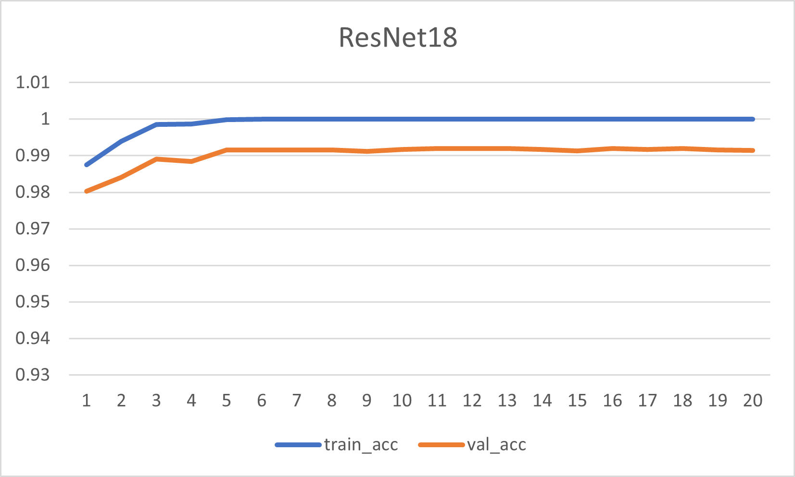
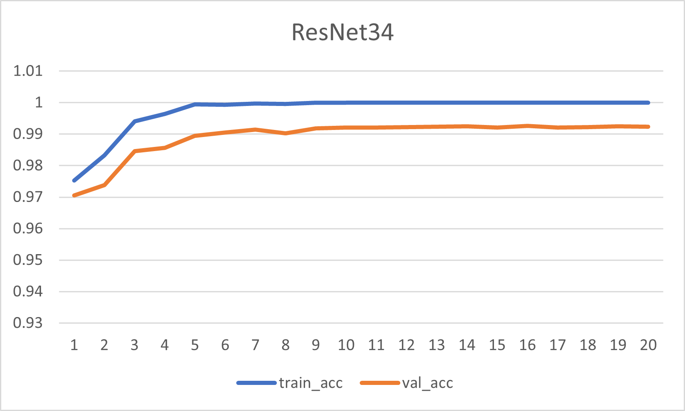
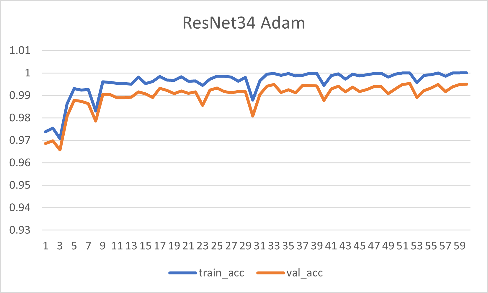
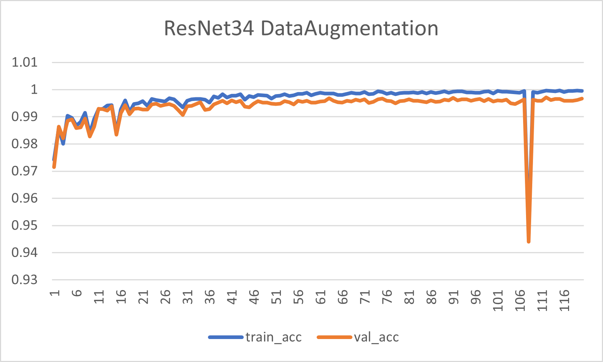
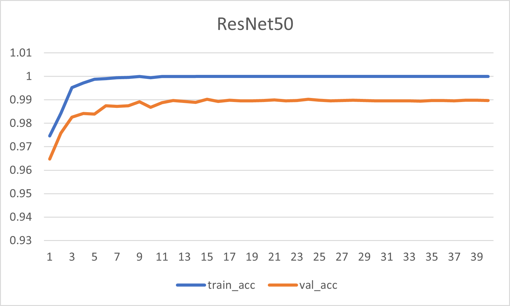
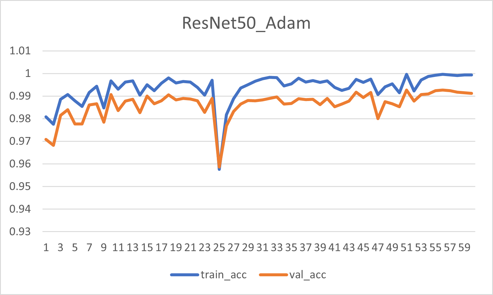

# [digit-recognizer](https://www.kaggle.com/c/digit-recognizer)
## データ
1. [データの可視化](visualize.ipynb)
## 学習
### ResNet18
1. [Momentum](resnet18/train_resnet18.ipynb)  
 
[train_resnet18.log](resnet18/train_resnet18.log)
### ResNet34
1. [Momentum](resnet34/train_resnet34.ipynb)  
 
[train_resnet34.log](resnet34/train_resnet34.log)
2. [Adam](resnet34/train_resnet34_adam.ipynb)  
 
[train_resnet34_adam.log](resnet34/train_resnet34_adam.log)
3. [Adam + DataAugmentation](resnet34/train_resnet34_data_augmentation.ipynb)  
 
[train_resnet34_data_augmentation.log](resnet34/train_resnet34_data_augmentation.log)
### ResNet50
1. [Momentum](resnet50/train_resnet50.ipynb)  
 
[train_resnet50.log](resnet50/train_resnet50.log)
2. [Adam](resnet50/train_resnet50_adam.ipynb)  
 
[train_resnet50_adam.log](resnet50/train_resnet50_adam.log)