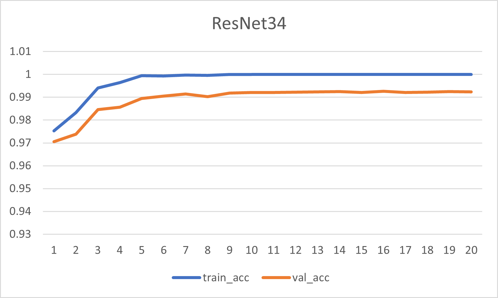

# [digit-recognizer](https://www.kaggle.com/c/digit-recognizer)
1. [データの可視化](visualize.ipynb)
2. [ResNet18で学習](train_resnet18.ipynb)  
 
[train_resnet18.log](train_resnet18.log)
3. [ResNet34で学習](train_resnet34.ipynb)  
 
[train_resnet34.log](train_resnet34.log)
4. [ResNet50で学習](train_resnet50.ipynb)  
 
[train_resnet50.log](train_resnet50.log)
4. [Adamで学習](train_resnet50_adam.ipynb)  